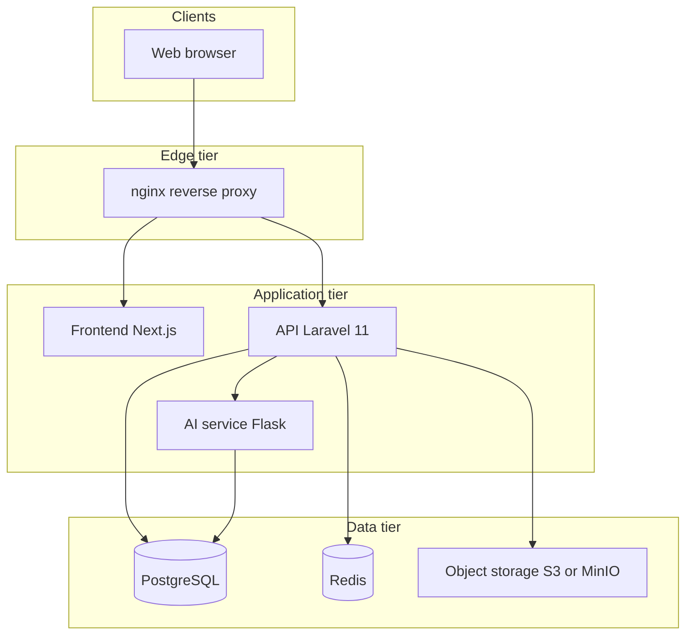

# System Architecture

## Overview

The AI Risk Management System (RMS) is a three-tier web application with a decoupled AI microservice, aligned to **ISO 31000:2018** risk management principles. Users submit risk tickets, AI assists with summarization and classification, and officers audit and approve mitigation through a defined state machine.

## Logical architecture

## Roles and responsibilities

| Role | Responsibilities |
|------|------------------|
| Department Supervisor | Create/edit risk reports, implement approved solutions, submit accomplishments |
| Risk Management Officer (RMO) | Validate reports, accept/reject, define mitigation, final validation |
| Audit Officer | Review and approve solutions before implementation |
| Executive | Dashboard view; comment on Critical/High risks only |
| Employee | General staff access to assigned risk workflows |

## Workflow summary

Based on [`RMS FLOWCHART.png`](../RMS%20FLOWCHART.png):

1. Supervisor logs in and creates a risk report (5W1H + evidence).
2. AI summarizes and categorizes; supervisor reviews and submits.
3. RMO validates — reject (return for revision) or accept and create solution.
4. Audit Officer reviews solution — insufficient (return to RMO) or approve.
5. Supervisor implements; submits accomplishment report.
6. RMO validates effectiveness — close ticket or loop revised solution through audit.
7. Executive monitors by level/category; monitoring and audit trail run continuously.

## Ticket state machine

| Status | Description |
|--------|-------------|
| Draft | Supervisor composing report |
| Submitted | Sent for processing |
| Under AI Analysis | NLP/classification running |
| Under RMO Review | Awaiting RMO decision |
| Under Audit Review | Solution with Audit Officer |
| Returned for Revision | Sent back to department |
| Approved | Solution approved, pending implementation |
| Action Required | Department must act |
| Implementation Ongoing | Mitigation in progress |
| Accomplishment Submitted | Awaiting final RMO validation |
| Under Final Validation | RMO reviewing results |
| Closed | Ticket complete |
| Reopened | Reopened for further action |

## API surface (planned)

Versioned REST under `/api/v1/`:

- Authentication (Sanctum / JWT)
- Risk tickets CRUD and workflow transitions
- Attachments and evidence
- AI classify/summarize (proxied to `ai-service`)
- Dashboards and reporting

Placeholder API responds at `/api/` via nginx until Laravel is installed.

## Data model (planned)

Core tables from V2 specification:

- `users` — RBAC roles
- `risk_tickets` — main entity with status, severity, category
- `risk_attachments`, `mitigation_plans`, `accomplishment_reports`
- `audit_logs` — immutable action history
- `ai_analysis_results` — model output and confidence

## Technology stack

| Layer | Technology |
|-------|------------|
| Frontend | React 18 / Next.js 14, Tailwind, shadcn/ui |
| API | Laravel 11, Sanctum, PHP 8.3 |
| Database | PostgreSQL 16 |
| Cache/queue | Redis 7 |
| AI | Python 3.11, Flask, scikit-learn, SpaCy/NLTK |
| Edge | nginx 1.27 |
| Files | S3 (prod) / MinIO (dev) |

## Docker mapping

| Logical component | Container |
|-------------------|-----------|
| Reverse proxy | `nginx` |
| Frontend | `web` |
| API | `api` |
| AI | `ai-service` |
| Database | `postgres` |
| Cache | `redis` |
| Dev object store | `minio` (profile `dev`) |
| Dev mail | `mailpit` (profile `dev`) |

See [Docker Guide](DOCKER.md) and [Port Registry](PORT_REGISTRY.md).

## Security architecture

- TLS at nginx (production)
- RBAC enforced in API
- Secrets via Docker secrets files (not in git)
- Network segmentation: `rms_edge`, `rms_app`, `rms_data`

Details: [Container Security](CONTAINER_SECURITY.md).

## Alternate backend

Node.js 20 + Express is documented as an alternative in [ADR 001](adr/001-backend-laravel.md). Port registry and networks remain the same; swap the `api` image and upstream configuration.
