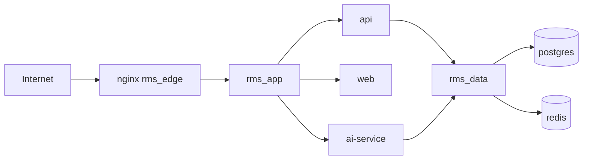

# Container Security

Security controls for the RMS Docker stack. Implementation lives in [`docker/compose.yml`](../docker/compose.yml), [`docker/compose.prod.yml`](../docker/compose.prod.yml), and service Dockerfiles.

## Threat model

| Asset | Risk | Mitigation |
|-------|------|------------|
| PostgreSQL (risk tickets, PII) | Exfiltration via open port | `rms_data` network only; no host bind in prod |
| Redis (sessions, queues) | Session hijack | Internal network; no host publish |
| AI service | Model abuse, prompt injection | Not exposed on host; API gateway only |
| API keys / DB password | Leak via git or logs | Docker secrets + `.env` gitignored |
| Edge (nginx) | OWASP Top 10 | TLS at edge; rate limits (app layer); minimal headers |

**Exposed attack surface (production):** `nginx` on ports 80/443 only.



## Network segmentation

| Network | Services | Purpose |
|---------|----------|---------|
| `rms_edge` | `nginx` | Public HTTP termination |
| `rms_app` | `nginx`, `web`, `api`, `ai-service`, `mailpit` (dev) | Application tier |
| `rms_data` | `postgres`, `redis`, `minio` (dev), `api`, `ai-service` | Data tier; no direct internet route |

Rules enforced in compose:

- `postgres` and `redis` are attached only to `rms_data` (and consumers that need DB access).
- `ai-service` is not on `rms_edge`.
- Host port mappings for data services use `127.0.0.1` and **profiles** (`dev-db`, `dev`) so they are opt-in.

## Secrets management

| Secret | Storage (dev) | Storage (prod) |
|--------|---------------|----------------|
| `DB_PASSWORD` | `docker/secrets/db_password.txt` (gitignored) | Same or external vault |
| `APP_KEY` | `docker/secrets/app_key.txt` (gitignored) | Rotate per environment |

Never commit:

- `.env`
- `docker/secrets/*.txt` (except `*.example`)

Use [`.env.example`](../.env.example) for variable names only. Generate secrets:

```powershell
# Example: create local secret files (do not commit)
New-Item -ItemType Directory -Force -Path docker/secrets
-join ((48..57) + (65..90) + (97..122) | Get-Random -Count 32 | ForEach-Object {[char]$_}) | Set-Content docker/secrets/db_password.txt
```

## Image supply chain

- Pin image digests/tags in compose (`postgres:16-alpine`, `redis:7.4-alpine`, not `latest`).
- Rebuild application images on dependency updates.
- Scan images before deploy (recommended tools: Docker Scout, Trivy):

```bash
docker scout cves rms-api:latest
```

## Runtime hardening (compose)

Applied to `web`, `api`, `ai-service`, and `nginx` where compatible:

| Control | Setting |
|---------|---------|
| Non-root user | `user:` in Dockerfiles / compose |
| Capabilities | `cap_drop: [ALL]` |
| Privilege escalation | `security_opt: no-new-privileges:true` |
| Filesystem | `read_only: true` + `tmpfs` for `/tmp`, cache dirs (prod profile) |
| Privileged mode | Never enabled |
| Docker socket | Never mounted |
| Resource limits | `deploy.resources.limits` in prod compose |

## Data protection

- **PostgreSQL:** Named volume `rms_postgres_data`; encrypt volume at host/filesystem level in production.
- **Redis:** Cache and queues only; do not store long-term PII.
- **Backups:** See [`OPERATIONS.md`](OPERATIONS.md).
- **File uploads:** MinIO in dev; production S3 with IAM least privilege (documented in [`ENVIRONMENT.md`](ENVIRONMENT.md)).

## TLS

| Layer | Dev | Production |
|-------|-----|------------|
| Client → nginx | HTTP (`:8080`) | HTTPS (`:443`) with valid certificates |
| nginx → app containers | HTTP on `rms_app` | HTTP acceptable on isolated bridge; optional mTLS for high assurance |

Mount certificates in prod via `docker/nginx/certs/` (gitignored) or external secret store.

## RBAC and containers

Application RBAC (Supervisor, RMO, Audit, Executive) is enforced in the **API**, not by Docker. Container boundaries ensure:

- Only `api` can reach `postgres` and `redis` for business data.
- `web` cannot reach the database directly.
- `ai-service` receives only what the API sends (no direct browser access).

## Audit and logging

| Layer | Requirement |
|-------|-------------|
| Application | Immutable audit log for ticket state changes (V2 spec) |
| Containers | `docker compose logs` / centralized log driver in production |
| nginx | Access logs for `/api/` and auth failures |

Retain logs per organizational policy (recommended: 90+ days for compliance workflows).

## Security checklist (pre-deploy)

- [ ] `.env` and `docker/secrets/*` are not in git
- [ ] `docs/PORT_REGISTRY.md` matches `docker compose config` output
- [ ] Postgres not bound to `0.0.0.0` on host
- [ ] `ai-service` has no public host port in production
- [ ] Images rebuilt with current base image patches
- [ ] TLS certificates valid and auto-renewal configured
- [ ] Default MinIO/Mailpit credentials changed or profiles disabled in prod

## Related documents

- [Port Registry](PORT_REGISTRY.md)
- [Docker Guide](DOCKER.md)
- [Environment Variables](ENVIRONMENT.md)
- [Operations](OPERATIONS.md)
